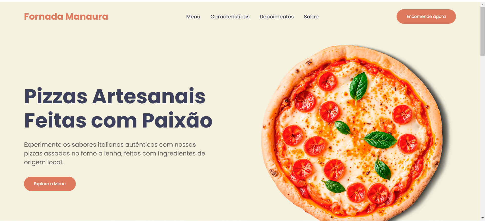

# 🍕 Fornada Manauara

**Fornada Manauara** é um site moderno e responsivo para uma pizzaria fictícia, oferecendo uma experiência visual agradável, navegação fluida e recursos interativos. Criado com foco em apresentar o cardápio de forma atrativa, destacar os diferenciais do serviço e gerar conversões através de CTAs estratégicos.

## 📸 Demonstração



## 🧑‍🍳 Sobre o Projeto

Este projeto simula o site de uma pizzaria artesanal localizada em Manaus. Com um design inspirado na gastronomia italiana, oferece seções bem estruturadas para apresentação do menu, diferenciais da marca, depoimentos de clientes e informações de contato.

## 🚀 Funcionalidades

- ✅ Design 100% responsivo
- ✅ Filtro de menu por categoria (Pizzas, Massas, Todos)
- ✅ Scroll suave para navegação interna
- ✅ Animações ao rolar a página
- ✅ Estilização com paleta personalizada usando variáveis CSS
- ✅ Layout moderno com foco em UX/UI

## 🛠️ Tecnologias Utilizadas

- HTML5
- CSS3 (com uso de variáveis, grid e flexbox)
- JavaScript Vanilla
- Font Awesome (ícones)
- Google Fonts (tipografia)

## 📁 Estrutura do Projeto

Fornada-Manauara/ │ ├── index.html # Estrutura principal da página ├── style.css # Estilos personalizados ├── script.js # Funcionalidades JS (filtro, scroll e animações) └── assets/ # Imagens e recursos visuais


## 📱 Responsividade

O site adapta-se perfeitamente a dispositivos móveis, com navegação otimizada e elementos reorganizados para telas menores.

## ✨ Como Usar

1. Clone o repositório:
   ```bash
   git clone https://github.com/seu-usuario/fornada-manauara.git

   Abra o arquivo index.html no navegador.

## 📌 Melhorias Futuras
- Integração com sistema de pedidos online

- Seção de localização com Google Maps

- Adição de um formulário de contato

- Página de login para área administrativa

## 👨‍💻 Autor
Projeto desenvolvido por Alexandre Lima — apaixonado por desenvolvimento web e design de interfaces.

Feito com 🍕 e ☕ em Manaus.


